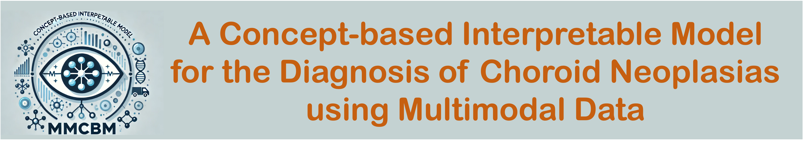

# A Concept-based Interpretable Model for the Diagnosis of Choroid Neoplasias using Multimodal Data

[](https://arxiv.org/abs/2403.05606)
 
 



<font size=7><div align='center' >
[[📖 arXiv Paper](https://arxiv.org/abs/2403.05606)]
[[📊 Dataset](https://github.com/BradyFU/Video-MME?tab=readme-ov-file#-dataset)]
[[🌟 Demo](https://mmcbm.liuy.site)] </div></font>

---
## 🔥 News
* **`2024.09.06`** 🌟 We have open-sourced our dataset *`CTIs: the largest `*.
* **`2024.09.05`** 🌟 We have submitted our paper to Nature Communications. The paper is under review.
* **`2024.06.03`** 🌟 We have open-sourced the checkpoint of **MMCBM**.

---
## 👀 Introduction
This is the official repository for **MMCBM: A Concept-based Interpretable Model for the Diagnosis of Choroid Neoplasias using Multimodal Data**


## 🔍 Dataset
To support the development of interpretable models for diagnosing choroidal tumors, 
we built the Choroid Tri-Modal Imaging (CTI) dataset, an anonymized, multimodal, 
and annotated collection of medical images from Beijing Tongren Hospital encompassing Fluorescence Angiography (FA), 
Indocyanine Green Angiography (ICGA), and Ocular Ultrasound (US) images. 
The construction of this dataset was approved by the Ethics Committee of Beijing Tongren Hospital.
**License**:
```
CTI dataset is only used for academic research. Commercial use in any form is prohibited.
The copyright of the dataset belongs to Beijing Tongren Hospital.
Without prior approval, you cannot distribute, publish, copy, disseminate, or modify CTI in whole or in part. 
You must strictly comply with the above restrictions.
```


## Installation

1. Create a conda environment from the `environment.yml` file:
   ```bash
   conda env create -f environment.yml
   ```

2. Install from the requirements.txt file:
   ```bash
   pip install -r requirements.txt
   ```

## Preparation

📍**download**
download the checkpoint from the [model checkpoint](https://drive.google.com/drive/folders/1YwDhqC_M9ACBnGjn_8IZouWHgJx1ue5Q?usp=drive_link), and put it in the `work_dir/result` directory. 
After downloading, the directory structure should look like this:
 + backbone: pretrained encoders trained on the same dataset split as MMCBM. Put the backbone in 
   ```bash
    work_dir/result/Efficientb0_SCLS_attnscls_CrossEntropy_32
   ```
 + MMCBM (Optional): the checkpoint of the MMCBM model. Put the MMCBM in
   ```bash
   work_dir/result/CAV_m2CBM_sigmoid_C0.1CrossEntropy_32_report_strict_aow_zero_MM_max
   ```


📍 ⚙️**configuration**
+ ChatGPT
   fill in the `openai_info` section in `params.py` with your own `api_key` and `api_base` from OpenAI. 
+ Tencent Translation (Optional)
   fill in the `tencent_info` section in `params.py` with your own `app_id` and `app_key` from Tencent Cloud.
## ♻️ Training
To train the MMCBM, you should first download our CTI dataset and put it in the `<work dir>/data` directory. 
And then download the pre-trained backbone and put it in the `<work dir>/result/Efficientb0_SCLS_attnscls_CrossEntropy_32` directory.
Then you can run the following command in the terminal:
```bash
    python train_CAV_CBM.py --name <dirname of experiment> --backbone <backbone dir> --epoch 200 --lr 1e-3 --device 0 --bz 8 --k 0
```

For five-fold cross-validation, you can run the following command in the terminal:
```bash
    python execute_concept.py --name <dirname of experiment>  --bz 8  --backbone <backbone dir> --clip_name cav --device 1,2,3,4,5 --k 0,1,2,3,4,5 --lr 0.001
```

## 🔮 Usage
📍 **Web Interface**
1. Web Interface using Gradio (Recommended), our web interface is available
   at [Interface Link](https://mmcbm.liuy.site).
2. you can also run this website locally by running the following command in the terminal:
   ```bash
   python web_interface.py
   ```
   then open the browser and enter `http://127.0.0.1:7860/` to access the website.
3. you can also build the docker image and run it:
   ```bash
   docker build -t mmcbm .
   docker run --name mmcbm -p 7860:7860 mmcbm
   ```
   then open the browser and enter `http://127.0.0.1:7890` to access the website.

📍**Command Line :**

Command Line without Gradio. We also provide a bash script to run the model inference from the command line:
   ```bash
   python mmcmb_inference.py
   ```


## ✒️  Citation

If you find our work helpful for your research, please consider citing our work.   

```bibtex
@article{fu2024video,
  title={Video-MME: The First-Ever Comprehensive Evaluation Benchmark of Multi-modal LLMs in Video Analysis},
  author={Fu, Chaoyou and Dai, Yuhan and Luo, Yondong and Li, Lei and Ren, Shuhuai and Zhang, Renrui and Wang, Zihan and Zhou, Chenyu and Shen, Yunhang and Zhang, Mengdan and others},
  journal={arXiv preprint arXiv:2405.21075},
  year={2024}
}
```